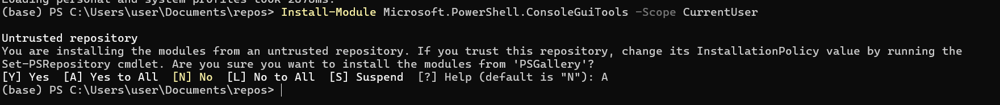

# Философия PowerShell.

### Часть 4: Интерактивная работа: `Out-ConsoleGridView`, exif, алерты.


#### `Out-ConsoleGridView`. GUI в консоли PowerShell.


**❗ Важно:** Все описываемые ниже инструменты требуют **PowerShell 7.2 или новее**.

Out-ConsoleGridView — это интерактивная таблица, прямо в консоли PowerShell, позволяющая:
- просматривать данные в виде таблицы;
- фильтровать и сортировать колонки;
- выбирать строки курсором — для передачи их дальше по пайплайну.
- и многое другое.

`Out-ConsoleGridView` является частью модуля `Microsoft.PowerShell.ConsoleGuiTools`. 
Для его использования сначала нужно установить этот модуль.

Для установки модуля выполните следующую команду в PowerShell:
```powershell
Install-Module Microsoft.PowerShell.ConsoleGuiTools -Scope CurrentUser
```


*Install-Module* загружает и устанавливает указанный модуль из репозитория в систему. 
Аналоги: `pip install` в `Python` или `npm install` в `Node.js`.

📎 Ключевые параметры *Install-Module*

------------------------------------------------------------------------------------------------------------------------------------------------------
| Параметр           | Описание                                                                                                                      |
| ------------------ | ----------------------------------------------------------------------------------------------------------------------------- |
| `-Name`            | Имя модуля, который нужно установить.                                                                                         |
| `-Scope`           | Область установки: `AllUsers` (по умолчанию, требует прав администратора) или `CurrentUser` (не требует прав администратора). |
| `-Repository`      | Указывает репозиторий, например `PSGallery`.                                                                                  |
| `-Force`           | Принудительная установка без подтверждения.                                                                                   |
| `-AllowClobber`    | Разрешает перезаписать уже существующие команды.                                                                              |
| `-AcceptLicense`   | Автоматически принимает лицензию модуля.                                                                                      |
| `-RequiredVersion` | Устанавливает конкретную версию модуля.                                                                                       |


После установки вы можете передавать любой вывод в `Out-ConsoleGridView` для интерактивной работы.

```powershell   
# Классческий пример: вывод списка процессов в интерактивную таблицу
Get-Process | Out-ConsoleGridView
```

video

<video width="600" controls>
  <source src="https://github.com/user-attachments/assets/3f1a2a62-066f-4dbb-947a-9b26095da356" type="video/mp4">
  Your browser does not support the video tag.
</video>


**Интерфейс:**
*   **Фильтрация:** Просто начните вводить текст, и список будет отфильтрован на лету.
*   **Навигация:** Используйте клавиши-стрелки для перемещения по списку.
*   **Выбор:** Нажмите `Space` для выбора/снятия выделения с одного элемента.
*   **Множественный выбор:** `Ctrl+A` для выбора всех элементов, `Ctrl+D` для снятия всего выделения.
*   **Подтверждение:** Нажмите `Enter`, чтобы вернуть выбранные объекты.
*   **Отмена:** Нажмите `ESC`, чтобы закрыть окно без возврата данных.


## Что умеет `Out-ConsoleGridView`:

* Отображать табличные данные прямо в консоли в виде интерактивной таблицы с навигацией по строкам и столбцам.
* Сортировать столбцы по нажатию клавиш.
* Фильтровать данные с помощью поиска.
* Выбирать одну или несколько строк с возвратом результата.
* Работать в чистой консоли без GUI-окон.
* Поддерживать большое количество строк с прокруткой.
* Поддерживать различные типы данных (строки, числа, даты и пр.).

---

## Примеры использования `Out-ConsoleGridView`

### 1. Базовое использование — показать таблицу с возможностью интерактивного выбора

```powershell
Import-Module Microsoft.PowerShell.ConsoleGuiTools

$data = Get-Process | Select-Object -First 30 -Property Id, ProcessName, CPU, WorkingSet

# Вывести таблицу с возможностью фильтрации, сортировки и выбора строк
$selected = $data | Out-ConsoleGridView -Title "Select process(es)" -PassThru

$selected | Format-Table -AutoSize
```

**Описание:**
Выводится список процессов в интерактивной консольной таблице. Можно фильтровать по имени, сортировать столбцы и выбирать процессы. Выбранные процессы возвращаются в переменную `$selected`.

---

### 2. Выбор одной строки с обязательным возвратом результата

```powershell
$choice = Get-Service | Select-Object -First 20 | Out-ConsoleGridView -Title "Select a service" -OutputMode Single

Write-Host "You selected service: $($choice.Name)"
```

**Описание:**
Пользователь выбирает одну строку (службу). `-OutputMode Single` запрещает выбирать несколько.

---

### 3. Фильтрация и сортировка больших массивов

```powershell
$data = 1..1000 | ForEach-Object {
    [PSCustomObject]@{
        Number = $_
        Square = $_ * $_
        Cube   = $_ * $_ * $_
    }
}

$data | Out-ConsoleGridView -Title "Numbers and powers" -PassThru
```

**Описание:**
Показывает таблицу из 1000 строк с числами и их степенями. Можно фильтровать и сортировать прямо в консоли.


1.  **Интерактивное управление процессами:**
    Вы можете выбрать несколько процессов для остановки. Параметр `-OutputMode Multiple` указывает, что мы хотим вернуть все выбранные элементы.

    ```powershell
    # Выбираем процессы в интерактивном режиме
    Get-Process | Out-ConsoleGridView -OutputMode Multiple
    ```

    ```powershell
    # Передаём результаты по конвейеру.
    # Останавливаем выбранные процессы с параметром -WhatIf для предварительного просмотра.
    # Для этого определим переменную $procsToStop
    $procsToStop = Get-Process | Out-ConsoleGridView -OutputMode Multiple
    
    # Если что-то было выбрано, передаем объекты дальше по конвейеру
    if ($procsToStop) {
        $procsToStop | Stop-Process -WhatIf
    }
    ```

2.  **Выбор файлов для архивации:**
    Найдем все `.log` файлы в папке, выберем нужные и создадим из них архив.

    ```powershell
    $filesToArchive = Get-ChildItem -Path C:\Logs -Filter "*.log" -Recurse | Out-ConsoleGridView -OutputMode Multiple
    ```
    ❗Будьте осторожны с рекурсией

    ```powershell
    if ($filesToArchive) {
        Compress-Archive -Path $filesToArchive.FullName -DestinationPath C:\Temp\LogArchive.zip
    }
    ```

3.  **Выбор одного элемента для детального анализа:**
    `Out-ConsoleGridView` по умолчанию возвращает один объект (`-OutputMode Single`), что удобно для выбора одного элемента и его детального изучения.

    ```powershell
    # Выбираем один сетевой адаптер
    $adapter = Get-NetAdapter | Out-ConsoleGridView
    
    # Если адаптер был выбран, получаем его полную IP-конфигурацию
    if ($adapter) {
        Get-NetIPConfiguration -InterfaceIndex $adapter.InterfaceIndex
    }
    ```


---

### 4. Использование с выбором нескольких строк и пост-обработкой

```powershell
$services = Get-Service | Out-ConsoleGridView -Title "Select services to stop" -PassThru

foreach ($svc in $services) {
    Stop-Service -Name $svc.Name -WhatIf
}
```

**Описание:**
Пользователь выбирает несколько служб из списка, и скрипт имитирует их остановку (`-WhatIf`).

---

### 5. Пример с кастомным заголовком и подсказками

```powershell
Get-EventLog -LogName System -Newest 50 |
    Select-Object TimeGenerated, EntryType, Source, Message |
    Out-ConsoleGridView -Title "System Events" -PassThru
```

**Описание:**
Показ журнала событий Windows в интерактивной таблице с заголовком "System Events".


---

## Варианты реализации алертов в PowerShell.

### 1. Уведомление в виде всплывающего окна (MessageBox).

```powershell
Add-Type -AssemblyName PresentationFramework
[System.Windows.MessageBox]::Show("Диск почти заполнен!", "Алерт", "OK", "Warning")
```

### 2. Уведомление в трей.
```powershell
Add-Type -AssemblyName System.Windows.Forms
Add-Type -AssemblyName System.Drawing

$notifyIcon = New-Object System.Windows.Forms.NotifyIcon
$notifyIcon.Icon = [System.Drawing.SystemIcons]::Information
$notifyIcon.BalloonTipTitle = "⚠️ Внимание"
$notifyIcon.BalloonTipText = "Процесс завершился с ошибкой"
$notifyIcon.Visible = $true

$notifyIcon.ShowBalloonTip(5000)  # 5 секунд

Start-Sleep -Seconds 6
$notifyIcon.Dispose()
```

Подходит для простых уведомлений на десктопе Windows.

---

### 3. 📧 Email-уведомление (SMTP).

```powershell
Send-MailMessage -To "you@example.com" `
    -From "alert@example.com" `
    -Subject "Внимание: проблема" `
    -Body "Что-то пошло не так" `
    -SmtpServer "smtp.example.com"
```

Поддерживает аутентификацию, SSL, вложения. Можно использовать для системных алертов, особенно с сервера.

---

### 4. 📱 Уведомление в Telegram.

```powershell
$token = "<token>"
$chatId = "<chat_id>"
$text = "⚠️ Внимание: скрипт нашел ошибку"

Invoke-RestMethod -Uri "https://api.telegram.org/bot$token/sendMessage" `
    -Method Post -ContentType "application/json" `
    -Body (@{ chat_id = $chatId; text = $text } | ConvertTo-Json -Compress)
```

Подходит для быстрого получения алертов в реальном времени.

---

### 5. 💬 Slack / Discord Webhook.

```powershell
$body = @{
    content = "🚨 Ошибка в системе!"
} | ConvertTo-Json

Invoke-RestMethod -Uri "https://discord.com/api/webhooks/..." `
    -Method POST -ContentType "application/json" -Body $body
```

Аналогично работает с Slack, Mattermost и другими чатами.

---

