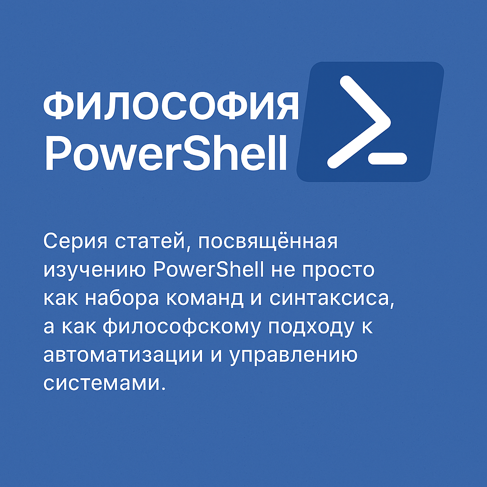

# Философия PowerShell

&nbsp;&nbsp;&nbsp;&nbsp;Цель этой серии — не создать очередной справочник командлетов. 
Ключевая идея, которую я буду раскрывать на протяжении всех глав, заключается в переходе от мышления текстом к **мышлению объектами**. 
Вместо того, чтобы работать с бесструктурными строками, я научу вас оперировать полноценными объектами с их свойствами и методами, 
передавая их по конвейеру, как по сборочной линии на заводе.

&nbsp;&nbsp;&nbsp;&nbsp;Эта серия поможет вам выйти за рамки простого написания команд и обрести осознанный инженерный подход к PowerShell,
как к мощному инструменту препарирования OS Windows.

---

## 🗺️ Оглавление

### **Раздел I: Фундамент и основы**

*   **[Часть 0: Что было до PowerShell?](./01.md)**
    *   Исторический экскурс: `COMMAND.COM`, `AUTOEXEC.BAT`, `CONFIG.SYS`.
    *   Сравнение с миром UNIX (`sh`, `csh`).
    *   Эволюция Windows: ядро NT и разрозненные инструменты администрирования.

*   **[Часть 1: Первый запуск и ключевые концепции](./01.md)**
    *   Проект Monad и рождение PowerShell.
    *   **Главная идея:** Объекты вместо текста.
    *   Синтаксис «Глагол-Существительное».
    *   Ваш главный помощник: `Get-Help`.

*   **[Часть 2: Конвейер, переменные и исследование объектов](./02.md)**
    *   Принципы работы конвейера (`|`).
    *   Работа с переменными (`$var`, `$_`).
    *   Анализ объектов с помощью `Get-Member`.
    *   *Пример кода: [system_monitor.ps1](./code/02/system_monitor.ps1)*

*   **[Часть 3: Навигация и управление файловой системой](./03.md)**
    *   Концепция провайдеров (`PSDrives`): файловая система, реестр, сертификаты.
    *   Операторы сравнения и логики.
    *   Введение в функции.
    *   *Примеры кода: [Find-DuplicateFiles.ps1](./code/03/Find-DuplicateFiles.ps1), [Backup-FolderToZip.ps1](./code/03/Backup-FolderToZip.ps1)*

*   **[Часть 4: Интерактивная работа: `Out-ConsoleGridView`, `F7History` и `ConsoleGuiTools`**

    *   `Where-Object`: Сито для объектов.
    *   `Sort-Object`: Упорядочивание данных.
    *   `Select-Object`: Выборка свойств и создание вычисляемых полей.

*   **[Часть 5: Переменные и базовые типы данных](./05.md)**
    *   Переменные как объекты `PSVariable`.
    *   Области видимости (Scope).
    *   Работа со строками, массивами и хеш-таблицами.

### **Раздел III: От скриптов к профессиональным инструментам**

*   **[Часть 6: Основы скриптинга. Файлы `.ps1` и политика выполнения](./06.md)**
    *   Переход от интерактивной консоли к файлам `.ps1`.
    *   Политики выполнения (`Execution Policy`): что это и как настроить.

*   **[Часть 7: Логические конструкции и циклы](./07.md)**
    *   Принятие решений: `If / ElseIf / Else` и `Switch`.
    *   Повторение действий: циклы `ForEach`, `For`, `While`.

*   **[Часть 8: Функции — создаем свои командлеты](./08.md)**
    *   Анатомия продвинутой функции: `[CmdletBinding()]`, `[Parameter()]`.
    *   Создание справки (`Comment-Based Help`).
    *   Обработка конвейера: блоки `begin`, `process`, `end`.

*   **[Часть 9: Работа с данными: CSV, JSON, XML](./09.md)**
    *   Импорт и экспорт табличных данных с `Import-Csv` и `Export-Csv`.
    *   Работа с API: `ConvertTo-Json` и `ConvertFrom-Json`.
    *   Основы работы с XML.

*   **[Часть 10: Модули и PowerShell Gallery](./10.md)**
    *   Организация кода в модули: `.psm1` и `.psd1`.
    *   Импорт модулей и экспорт функций.
    *   Использование глобальной библиотеки `PowerShell Gallery`.

### **Раздел IV: Продвинутые техники и финальный проект**

*   **[Часть 11: Удаленное управление и фоновые задачи](./11.md)**
    *   Основы PowerShell Remoting (WinRM).
    *   Интерактивные сессии (`Enter-PSSession`).
    *   Массовое управление с `Invoke-Command`.
    *   Запуск длительных операций в фоне (`Start-Job`).

*   **[Часть 12: Введение в GUI на PowerShell с помощью Windows Forms](./12.md)**
    *   Создание окон, кнопок и меток.
    *   Обработка событий (нажатие кнопки).

*   **[Часть 13: Проект "CPU-монитор" — Проектирование интерфейса](./13.md)**
    *   Компоновка графического интерфейса.
    *   Настройка элемента `Chart` для отображения графиков.

*   **[Часть 14: Проект "CPU-монитор" — Сбор данных и логика](./14.md)**
    *   Получение метрик производительности с `Get-Counter`.
    *   Использование таймера для обновления данных в реальном времени.

*   **[Часть 15: Проект "CPU-монитор" — Финальная сборка и дальнейшие шаги](./15.md)**
    *   Добавление обработки ошибок (`Try...Catch`).
    *   Подведение итогов и идеи для дальнейшего развития.

---

## 🎯 Для кого эта серия?

*   **Для новичков**, которые хотят заложить прочный и правильный фундамент в изучении PowerShell, избежав распространенных ошибок.
*   **Для опытных администраторов Windows**, которые привыкли к `cmd.exe` или VBScript и хотят систематизировать свои знания, перейдя на современный и более мощный инструмент.
*   **Для всех**, кто хочет научиться думать не командами, а системами, и создавать элегантные, надежные и легко поддерживаемые сценарии автоматизации.

## ✍️ Обратная связь и участие

&nbsp;&nbsp;&nbsp;&nbsp;Если вы нашли ошибку, опечатку или у вас есть предложение по улучшению какой-либо из частей, пожалуйста, не стесняйтесь создавать **Issue** в этом репозитории.

## 📜 Лицензия

&nbsp;&nbsp;&nbsp;&nbsp;Весь код и тексты в этом репозитории распространяются под **[лицензией MIT](./LICENSE)**. Вы можете свободно использовать, изменять и распространять материалы с указанием авторства.